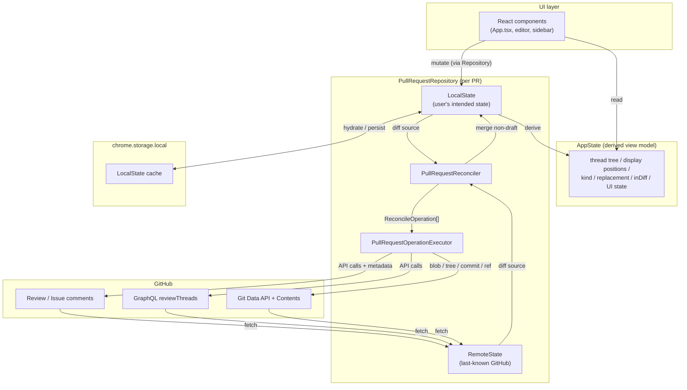
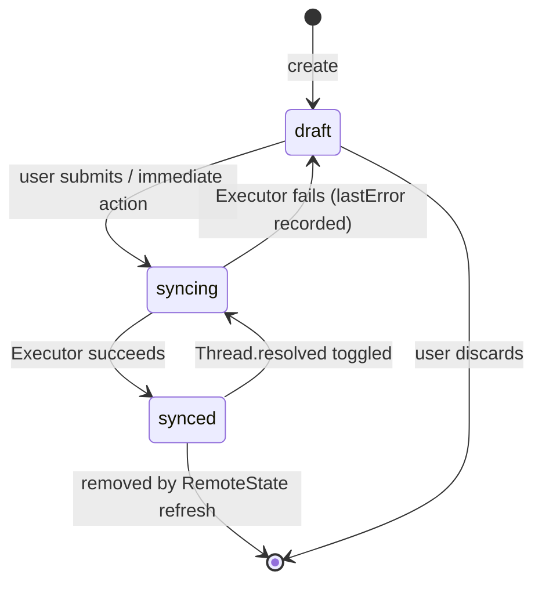
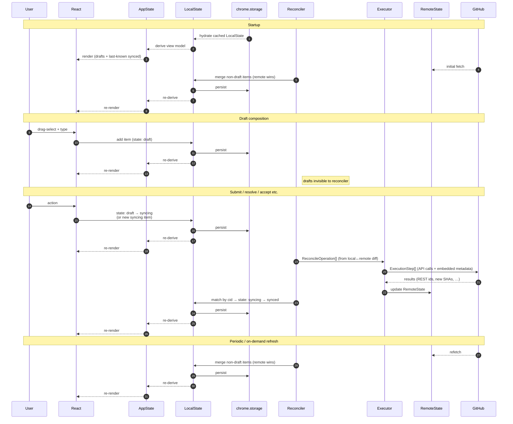

# ADR 0001: PR data flow — Repository, Reconciler, and Operation Executor pipeline

- Date: 2026-06-24
- Status: Accepted
- Supersedes: the ad-hoc data flow currently implemented across `lib/drafts.ts`, `lib/comments.ts`, `lib/storage.ts`, `lib/authorSubmit.ts`, and `entrypoints/review/App.tsx`
- Companion: [ADR 0002 — Data model](0002-data-model.md) defines the entity shapes that flow through this pipeline. This ADR scopes the _how_ (movement, lifecycle, components); ADR 0002 scopes the _what_ (entities, fields, identity).

## Context

Bark has no backend. Its data lives in three places:

1. React state (`App.tsx`) — the UI source of truth at runtime.
2. `chrome.storage.local` — local persistence for drafts, suggestion edits, dismissed-suggestion decisions, and authentication.
3. GitHub — the ultimate source of truth for pull-request comments, threads, resolutions, and file content, with Bark-specific metadata smuggled into comment bodies as base64-encoded HTML comments.

Bugs in this layer have been recurring (recent examples include PR #105, #106, #108, #109). An audit of the data model (see `/.local/tmp/architecture-data-model.md`) surfaced several root causes that surface bug-fixes cannot resolve:

- **Three representations of the same conceptual entity.** A "comment" exists as `PendingDraft`, `CommentMetadata`, and `ExistingComment`, with overlapping but non-identical fields, and translation logic scattered across `App.tsx`.
- **Position data carried in four shapes** (`AnchorRange`, `SourceAnchor`, `quote`, `sha`), each with its own failure mode in re-anchoring.
- **Hidden metadata embedding leaks into the in-memory model.** `CommentMetadata` is referenced throughout React state, not isolated as a wire format concern.
- **`inDiff` is computed once at draft creation and never refreshed**, so routing decisions stale as the PR evolves.
- **Two parallel systems of truth for thread resolution** — Bark's `event: "resolve"` marker comments and GitHub GraphQL `reviewThreads.isResolved` — can diverge silently.
- **`buildThreads` is a large derivation over six inputs.** Each new edge case requires a new compensating branch, which is the source of the recent regressions.
- **Silent fallbacks** in re-anchoring (`oldSources` fetch failures, fuzzy `quote` search) hide degradation from the user.

The pattern of bugs indicates that incremental patches reinforce these fragile coupling points rather than fixing them. A structural change is warranted.

## Decision

Adopt a Repository-based data layer with explicit separation between local-persistent data and PR-scoped data, and replace the ad-hoc submit/sync flow with an explicit state-diff/operation-execution pipeline.

### 1. Two data domains, two repository styles

**Local-persistent data** (authentication tokens, global preferences):

- Source of truth: `chrome.storage.local`.
- Accessed via per-model `Repository` classes, each injected with a `PersistentLocalStorageAdapter` that handles save/load.

**PR-scoped data** (comments, threads, suggestions, file edits, drafts):

- Source of truth: GitHub.
- Accessed via a single `PullRequestRepository` per PR.

### 2. PullRequestRepository internal structure

```
PullRequestRepository
├── LocalState                  // user's intended state, including drafts
├── RemoteState                 // last-known GitHub state (in-memory only)
├── PullRequestReconciler       // (LocalState, RemoteState) → Operation[]
└── PullRequestOperationExecutor // Operation[] → GitHub API calls + hidden metadata I/O
```

- **`LocalState` and `RemoteState` have the same structure**, as plain objects, so a structural diff between them is the unit of work.
- **`LocalState` is the only persisted state** (cached to `chrome.storage.local`). `RemoteState` is fetched fresh from GitHub each session; it is not cached.
- **`PullRequestReconciler`** computes the `ReconcileOperation`s needed to bring `RemoteState` into agreement with `LocalState`, given a diff. It knows about state but not about GitHub APIs.
- **`PullRequestOperationExecutor`** consumes `ReconcileOperation`s and turns them into `ExecutionStep`s — the actual GitHub API call sequences — handling batching, ordering, atomicity, and hidden-metadata serialization. It knows about GitHub and the wire format but not about higher-level state semantics.

`ReconcileOperation` and `ExecutionStep` are intentionally separate concepts: the former is a state-level intent (one per entity diff), the latter is an API-level unit of work (may bundle multiple Ops or fan out into multiple HTTP calls). The catalog of both is specified in [ADR 0003](0003-operations-and-execution.md).

### 3. Entity state machine

Every PR-scoped entity carries a state. The diagram is in the [Data flow](#entity-state-machine) section below; the semantics are:

- **`draft`** — user has a local change that has not yet been committed to sync. Invisible to the Reconciler; neither pushed to GitHub nor overwritten by a `RemoteState` refresh. May carry `lastError` from a previous failed sync attempt.
- **`syncing`** — user has committed to sync; an `ExecutionStep` is in flight for this item.
- **`synced`** — matches the last-known `RemoteState`. Reachable from `syncing` on success, or by being merged in from a `RemoteState` refresh.

Two paths into `syncing`:

- **`draft → syncing`** — the normal path for newly-created entities (Comment, FileEdit) that the user composes and then submits.
- **`synced → syncing`** — a mutable field on an already-synced entity changes. In practice the only such case is **`Thread.resolved` toggling** (resolve / unresolve), which is an immediate action with no separate compose step. Comments are immutable post-sync, and `FileEdit` has no synced state, so no other entity reaches this transition.

On failure, the entity returns to `draft` with `lastError` set. There is no automatic retry; the user re-submits explicitly. This keeps the Reconciler stateless about retry policy.

### 4. Conflict policy

`RemoteState` always wins for non-`draft` items.

- After each refresh, `synced` items in `LocalState` are overwritten by their remote counterparts; items absent from remote are removed.
- `draft` and `syncing` items are protected from refresh.
- No conflict-resolution UI is required. Edge cases (e.g. a `draft` reply to a remotely-deleted comment) are handled by treating the parent's removal as the trigger to orphan or discard the reply.

### 5. Wire-format encapsulation

Hidden metadata (the base64-encoded HTML-comment envelope used so that local identity round-trips through GitHub) is owned exclusively by `PullRequestOperationExecutor`. The Reconciler, `LocalState`, `RemoteState`, and downstream layers see plain entity fields only. The envelope's payload, its versioning, and the identity strategy it implements are specified in [ADR 0002 §5](0002-data-model.md).

Entity field shapes themselves — including the immutable creation-time anchor that backs re-anchoring — are out of scope for this ADR and live in [ADR 0002](0002-data-model.md).

### 6. Naming

- `PullRequestRepository` — the umbrella per-PR component.
- `PullRequestReconciler` — produces `ReconcileOperation`s from `(LocalState, RemoteState)` diffs.
- `PullRequestOperationExecutor` — turns `ReconcileOperation`s into `ExecutionStep`s and runs them against GitHub.
- `ReconcileOperation` — a state-level intent emitted by the Reconciler (one per entity diff). Fine-grained, independent. Cataloged in [ADR 0003](0003-operations-and-execution.md).
- `ExecutionStep` — an API-level unit of work the Executor performs. May bundle multiple `ReconcileOperation`s (e.g. a review batch) or expand into multiple HTTP calls (e.g. a commit). Cataloged in [ADR 0003](0003-operations-and-execution.md).

The Executor name was chosen over `Converter` / `GitHubGateway` / `GitHubAdapter` because (a) it is a verb-shaped name that mirrors `Reconciler`, (b) `Adapter` collides with the existing storage-adapter terminology, and (c) keeping `GitHub` out of the name leaves room for future backends without renaming the seam.

## Data flow

The Repository (`LocalState`, `RemoteState`, Reconciler, Executor) sits beneath an `AppState` view-model layer that React reads from. `AppState` is purely derived from `LocalState` plus session context, and is specified in [ADR 0002 §1, §4](0002-data-model.md). It is included in the diagrams below to make the read path explicit.

### Component structure



Only `LocalState` is persisted. `RemoteState` lives only in memory and is rebuilt from GitHub on every session. `AppState` is recomputed from `LocalState` on demand and is never persisted.

### Entity state machine



`draft` items are invisible to the Reconciler in both directions: neither pushed to GitHub nor overwritten by `RemoteState` refresh. The `synced → syncing` edge applies only to `Thread.resolved` toggling — see [§3](#3-entity-state-machine).

### Lifecycle sequence



### Failure handling

- An `ExecutionStep` that fails returns each affected item to `draft` with `lastError` set. User work is never lost.
- There is no automatic retry. The user sees the error and triggers the same action again, which moves the item `draft → syncing`. Keeping retry policy out of the Reconciler avoids a class of "phantom in-flight" bugs.
- Steps with partial-success semantics (e.g. one `PostReviewBatch` whose embedded comment posts split into successful and failed) report per-item results so each item lands in the correct state independently.
- User-facing error surfacing follows the global Snackbar policy from [ADR 0005 §4](0005-refresh-policy.md). Individual components may additionally reflect errors inline (e.g. a retry affordance near a failed draft Comment) per component judgement.

## Consequences

### Positive

- **One representation per entity.** Drafts, in-flight items, and synced items are the same shape with a different `state` field. The current three-way `PendingDraft` / `CommentMetadata` / `ExistingComment` split disappears.
- **Hidden-metadata hack is isolated.** Wire-format concerns no longer leak into React or business logic.
- **Position management is explicit.** Creation-time anchor is immutable data; display position is derived. The current four-way representation collapses.
- **`inDiff` becomes a property of the current diff, not the comment.** Routing is computed at execution time by the Executor, not frozen at draft creation.
- **Resolution has one source of truth** (GitHub GraphQL `isResolved`), surfaced into `RemoteState`. The Bark `event: "resolve"` marker, if retained at all, becomes an Executor implementation detail, not a parallel system.
- **Reconciler is pure** — `(LocalState, RemoteState) → ReconcileOperation[]` — and trivially unit-testable.
- **Bug surface area is predictable.** A class of bugs becomes "the diff was computed wrong" or "the operation was executed wrong" instead of "the derivation in `buildThreads` missed a case".

### Negative / costs

- **Larger refactor than incremental fixes.** This is a structural rewrite of the data layer, not a patch.
- **Catalogs must be specified.** Both `ReconcileOperation` and `ExecutionStep` need exhaustive enumeration — notably the atomic-N-comment review batch (an `ExecutionStep` bundling many Ops) and the commit step (one Op fanning into blob/tree/commit/updateRef). See [ADR 0003](0003-operations-and-execution.md).
- **Initial page load shows only cached drafts until GitHub responds.** Because `RemoteState` is not persisted, the first paint contains pending items only; synced items appear once the GitHub fetch completes. This is an acceptable trade-off but is a visible behavior change.
- **GitHub read-after-write lag still requires polling** inside the Executor. The lag is not eliminated; it is encapsulated.

### Deferred (to follow-up ADRs and specs)

No structural decisions remain deferred for the data-flow layer. Follow-up ADRs specify:

- [ADR 0002](0002-data-model.md) — entity field schemas.
- [ADR 0003](0003-operations-and-execution.md) — `ReconcileOperation` and `ExecutionStep` catalogs.
- [ADR 0004](0004-reanchoring.md) — re-anchoring algorithm and `RemoteState.FileContent` keyed by `(sha, path)`.
- [ADR 0005](0005-refresh-policy.md) — refresh trigger policy and Snackbar error surface.

No data-migration plan is required: Bark is pre-release, so no production data exists to migrate. Old hidden-metadata payloads encountered in test data are silently discarded — see [ADR 0003 §7](0003-operations-and-execution.md).

## References

- Data-flow audit: `/.local/tmp/architecture-data-model.md` (not committed; analysis notes).
- Original design doc: [`../design-doc.md`](../design-doc.md) (describes the existing implementation, including the hidden-metadata format and the current re-anchoring strategy this ADR proposes to restructure).
- Recent bugs motivating the rewrite: PR #105, #106, #108, #109.
