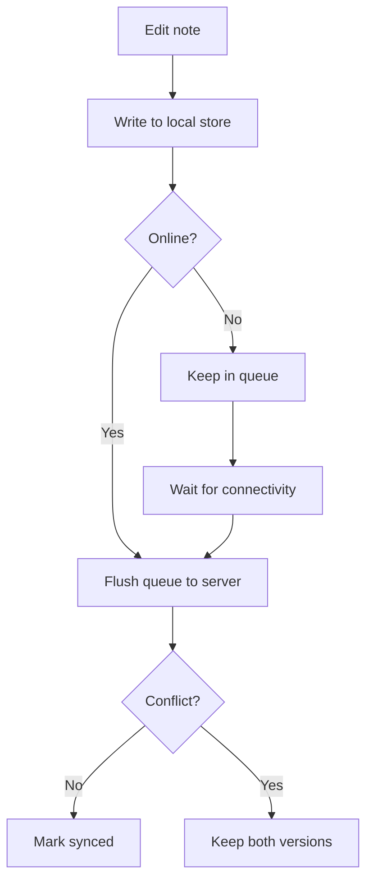

# RFC: Offline-First Sync for Fieldnote

- **Status:** Draft
- **Author:** A. Reviewer
- **Reviewers:** Platform team, Mobile team
- **Target release:** Q3

## Summary

Fieldnote is a note-taking app used by field technicians who frequently work in
areas with poor or no connectivity. Today, notes are saved directly to the
server, so a dropped connection means lost work. This RFC proposes an
**offline-first** sync model: notes are written to a local store first and
reconciled with the server when connectivity returns.

This is a really really important feature and we should ship it as fast as we
possibly can.

## Goals

1. A note created offline is never lost.
2. Edits made on multiple devices converge to a predictable result.
3. The sync layer is invisible to users in the common case.

### Non-goals

- Real-time collaborative editing (tracked separately in RFC-104).
- Conflict resolution UI beyond a simple "keep both" fallback.

## Background

The current write path is synchronous and server-bound:

| Step             | Where it runs | Fails offline? |
| ---------------- | ------------- | -------------- |
| Validate note    | Client        | No             |
| Persist note     | Server        | **Yes**        |
| Update list view | Client        | No             |

Because persistence happens on the server, any network interruption surfaces to
the user as a hard error. Telemetry shows this affects roughly 8% of write
attempts in low-connectivity regions.

## Proposed design

Writes go to a local queue first, then a background worker flushes the queue to
the server. Each note carries a `clientId` and a `lastEditedAt` timestamp so the
server can order edits deterministically.

```ts
type QueuedEdit = {
  clientId: string;
  noteId: string;
  body: string;
  lastEditedAt: number; // epoch millis
};

async function enqueueEdit(edit: QueuedEdit): Promise<void> {
  await localStore.append("pending-edits", edit);
  scheduler.wake(); // try to flush soon
}
```

The reconciliation flow looks like this:



> **Note:** "Keep both" is intentionally conservative. We would rather show a
> user two copies of a note than silently drop one of their edits.

## Rollout plan

- [x] Prototype the local queue behind a feature flag
- [ ] Add server-side ordering by `lastEditedAt`
- [ ] Migrate existing clients in three waves
- [ ] Remove the legacy synchronous write path

## Open questions

1. How long should the local queue retain unsynced edits before warning the
   user? See the discussion in [issue #212](https://example.com/issues/212).
2. Do we need a per-device cap on queued edits to bound local storage?

## Appendix

For prior art, see Google Docs' offline mode and the CRDT literature. The design
above deliberately avoids full CRDTs to keep the client small.
