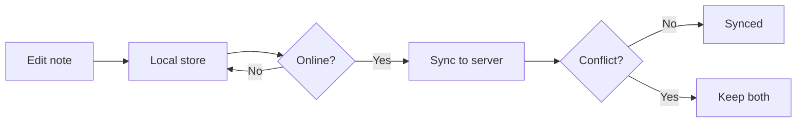

# Fieldnote — Offline Sync

Notes are saved **locally first**, then synced to the server when the device is
back online — so a dropped connection never loses work.

## Status

| Area     | State        | Owner    |
| -------- | ------------ | -------- |
| Queue    | ✅ Done      | Platform |
| Ordering | 🚧 In review | Server   |
| Rollout  | ⏳ Planned   | Mobile   |

## Sync flow



## Design notes

- Edits are flushed to the server in the backround by a worker.
- We cap the local queue at 500 edits per device.

```ts
async function enqueueEdit(edit: QueuedEdit) {
  await localStore.append("pending", edit);
  scheduler.wake();
}
```

> On conflict, Fieldnote keeps **both** versions instead of dropping an edit.
