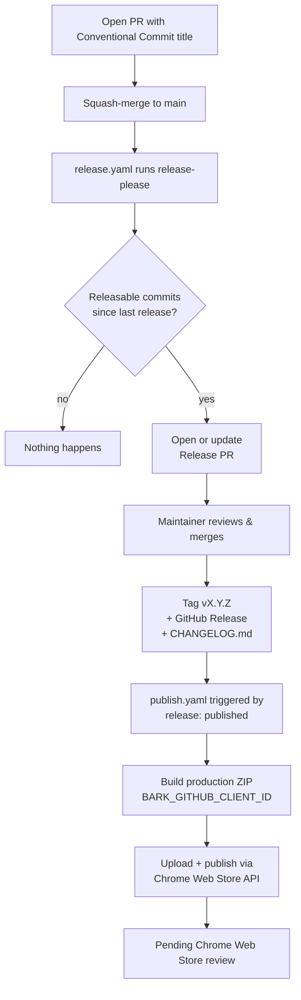
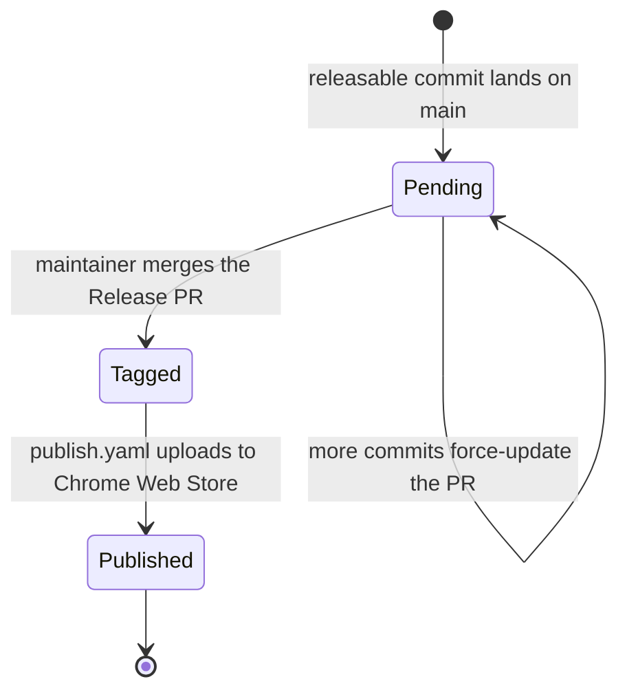

# Release flow

How a merged PR becomes a new version of Bark on the Chrome Web Store. The
flow is fully automated by two workflows:

- **`release.yaml`** runs [release-please](https://github.com/googleapis/release-please)
  on every push to `main`. It aggregates Conventional Commits into a single
  **Release PR**, and merging that PR tags the commit, writes
  `CHANGELOG.md`, and creates a GitHub Release.
- **`publish.yaml`** runs when a GitHub Release is published. It checks out
  the new tag, builds the production extension, and uploads + publishes it to
  the Chrome Web Store via the Web Store API.

A developer shipping a change only needs to write a Conventional Commit PR
title. Everything else — version, changelog, tag, Web Store upload — happens
without manual steps.

## Pieces in this repo

| File                                                                  | Role                                                                                                                                                                                |
| --------------------------------------------------------------------- | ----------------------------------------------------------------------------------------------------------------------------------------------------------------------------------- |
| [`.github/workflows/release.yaml`](../.github/workflows/release.yaml) | Runs release-please on every push to `main`. Opens / updates the Release PR; on merge tags `vX.Y.Z` and creates the GitHub Release.                                                 |
| [`.github/workflows/publish.yaml`](../.github/workflows/publish.yaml) | Runs on `release: { types: [published] }`. Builds the production ZIP, then uploads + publishes it to the Chrome Web Store.                                                          |
| [`release-please-config.json`](../release-please-config.json)         | `release-type: node` — release-please reads / writes `package.json`. `package-name: bark`.                                                                                          |
| [`.release-please-manifest.json`](../.release-please-manifest.json)   | The version release-please believes is "currently released". The next Release PR computes the next version from this baseline.                                                      |
| [`package.json`](../package.json)                                     | `version` is the single source of truth for the extension version. WXT copies it into the built `manifest.json` at build time, so the Web Store version always matches the git tag. |
| `CHANGELOG.md`                                                        | Generated by release-please from the Conventional Commits in each release. Do not hand-edit.                                                                                        |

### Why `publish-browser-extension` is pinned

`wxt submit` is a thin alias: it spawns WXT's `wxt-publish-extension` bin,
which runs `publish-browser-extension`'s **ESM** entry under Node. In
`publish-browser-extension` 3.x that entry is a bundle containing an esbuild
`__require` shim, so it dies with `Dynamic require of "buffer" is not
supported` the moment it loads its bundled `jsonwebtoken` copy — only the CJS
entry works there. 4.x ships a real ESM build with `jsonwebtoken` as a runtime
dependency, so `package.json` has an `overrides` entry pinning the transitive
dependency to `^4.0.5` (the highest major WXT 0.20 accepts). Removing the
override drops publishing back to a broken 3.x resolution.

## Conventional Commits and version bumps

The PR title becomes the squash-merge commit message, which is what
release-please reads to compute the next version. The repo enforces
Conventional Commits in PR checks.

| Commit type                                                                 | Pre-1.0 effect                                                         | Post-1.0 effect |
| --------------------------------------------------------------------------- | ---------------------------------------------------------------------- | --------------- |
| `feat:`                                                                     | minor (0.1.0 → 0.2.0)                                                  | minor           |
| `fix:`                                                                      | patch (0.1.0 → 0.1.1)                                                  | patch           |
| `feat!:` / `BREAKING CHANGE:` footer                                        | minor while < 1.0                                                      | major           |
| `chore:`, `docs:`, `ci:`, `refactor:`, `test:`, `style:`, `build:`, `perf:` | no bump on its own (still appears in changelog if `perf:`/`refactor:`) | same            |

Notes:

- Pre-1.0 semantics: release-please follows the [SemVer pre-1.0 convention]
  where breaking changes bump the minor, not the major, until the first 1.0
  release.
- The version that ships is the **highest** bump in the range of commits
  since the last release. One `feat:` in a batch of `fix:`es is a minor bump.
- To force a specific version, add `Release-As: x.y.z` as a footer on any
  merge commit on `main`. release-please picks that up and overrides its
  calculation.

[SemVer pre-1.0 convention]: https://semver.org/#spec-item-4

## End-to-end flow

Steps in words:

1. **Author a PR.** Use a Conventional Commit title (e.g.
   `feat(review): add inline suggestions`). The squash-merge commit inherits
   the PR title.
2. **Merge to `main`.** `release.yaml` runs and release-please walks commits
   since the manifest version. If at least one is releasable (`feat`, `fix`,
   or breaking), it opens (or force-updates) a single Release PR titled
   `chore(main): release bark <version>`. Otherwise the workflow exits
   silently.
3. **Review the Release PR.** It only touches `package.json`,
   `.release-please-manifest.json`, and `CHANGELOG.md`. No code is changed.
4. **Merge the Release PR.** release-please tags `v<version>`, creates the
   GitHub Release with the changelog body, and commits `CHANGELOG.md` to
   `main`.
5. **`publish.yaml` takes over.** Triggered by the `release: published`
   event, it checks out the tag, runs `bun run build` with the production
   `BARK_GITHUB_CLIENT_ID`, runs `bun run zip`, exchanges the OAuth refresh
   token for an access token, uploads the ZIP to the Web Store item, and
   publishes it. After that the new version enters Chrome Web Store review.

## Release PR lifecycle

Key properties:

- At most **one open Release PR at a time**. Each new releasable commit
  force-updates the same PR (cumulative).
- The `Tagged → Published` step is the boundary between the two workflows.
  Until publish.yaml succeeds the new version exists on GitHub but not on
  the Chrome Web Store.

## Hotfixes and manual overrides

- **Skip a release.** Close the open Release PR. The next releasable commit
  opens a fresh one with the cumulative changes.
- **Force a version.** Add `Release-As: 1.2.3` as a footer on a merge commit
  on `main`. release-please will use exactly that version for the next
  Release PR.
- **Edit the changelog.** Edit `CHANGELOG.md` inside the Release PR before
  merging. release-please preserves the edits on subsequent force-updates.
- **Re-run a failed publish.** `publish.yaml` is safe to retry: the upload
  step overwrites the in-review draft, and republishing the same version is
  a no-op. Re-run the failed job from the Actions UI, or trigger
  `publish.yaml` manually via `workflow_dispatch`.
- **Publish to trusted testers only.** Change the publish API call from
  `publishTarget=default` to `publishTarget=trustedTesters` in
  `publish.yaml`.
