# Mermaid samples

A grab-bag of Mermaid diagram types for verifying preview rendering in Bark.
Open this file in **Preview**: each `mermaid` block should render as a diagram,
and clicking into a block should reveal its source for editing.

## Flowchart

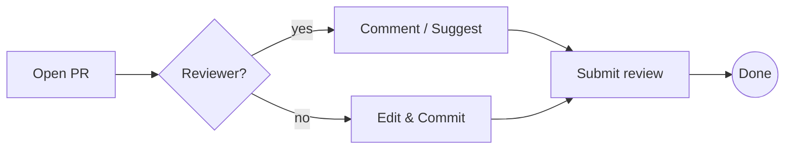

## Sequence diagram

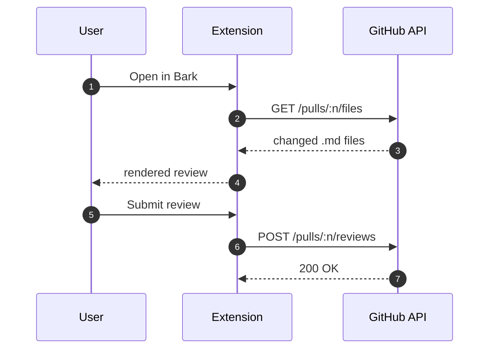

## Class diagram

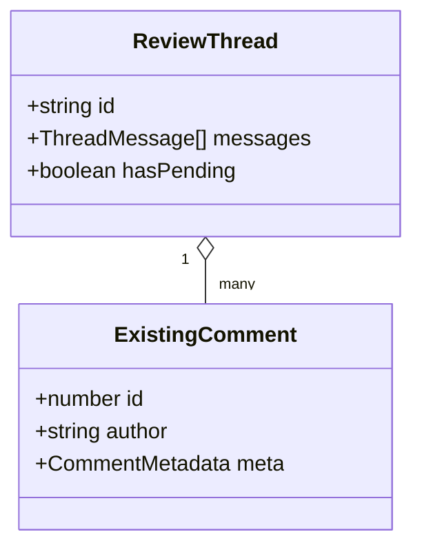

## State diagram

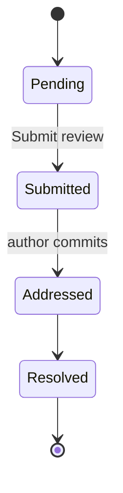

## Entity-relationship diagram

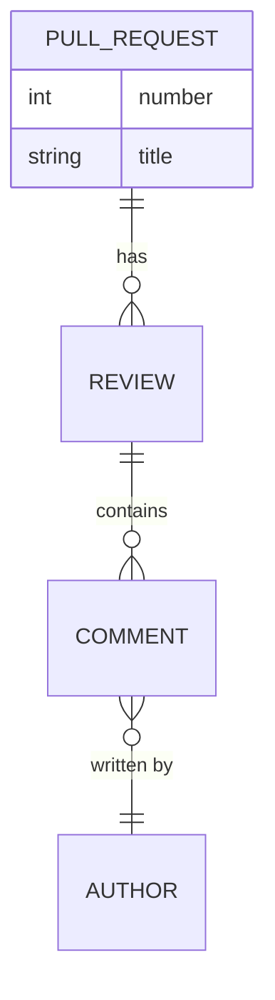

## Gantt chart

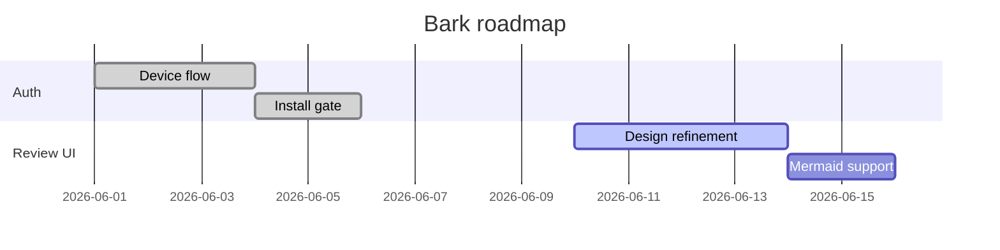

## Pie chart

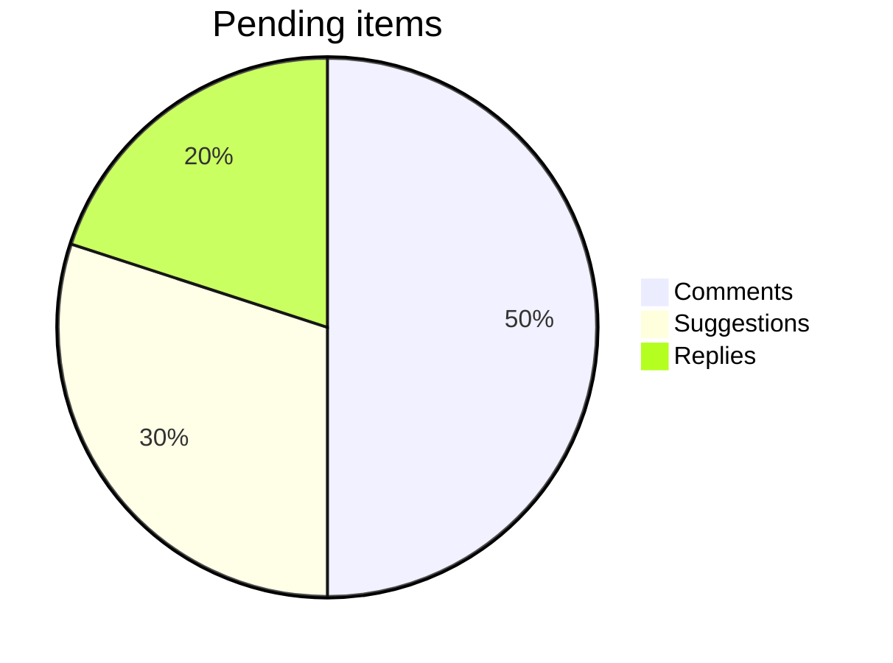

## Git graph

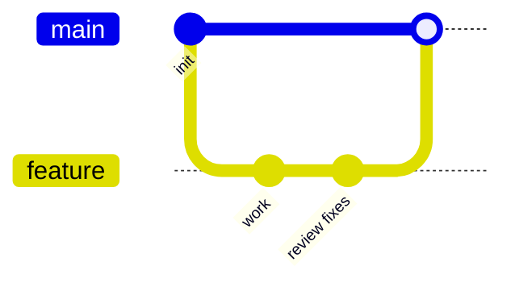

## User journey

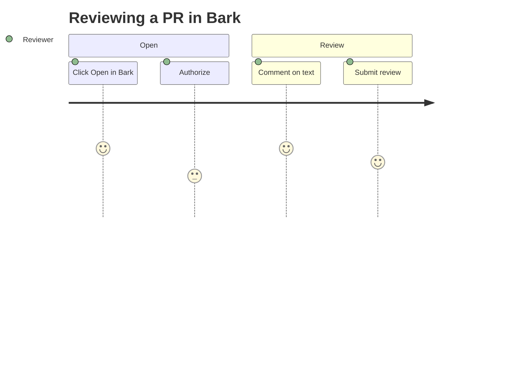

## Mindmap

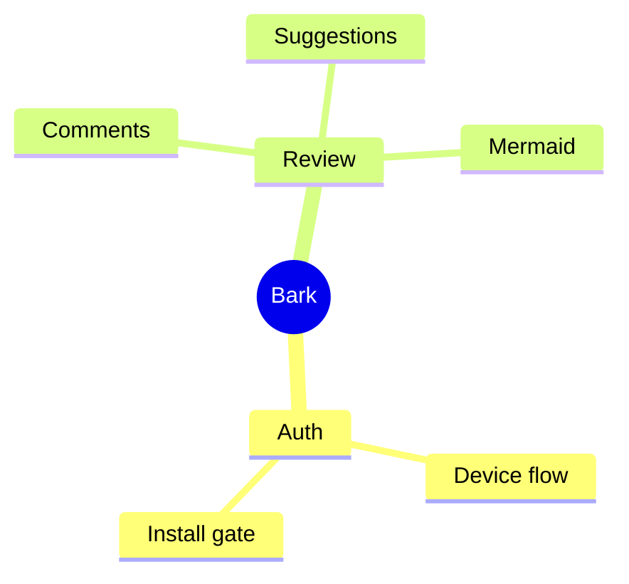

## Timeline

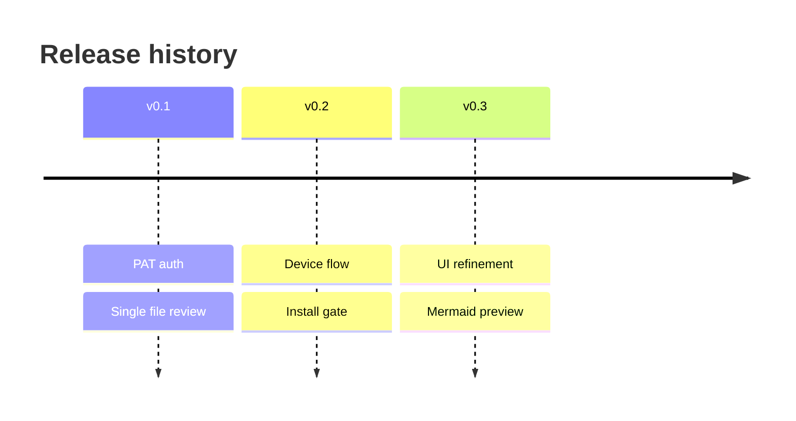

## Invalid diagram (error handling)

This block is intentionally broken — it should render an inline error message,
not crash the surrounding preview.

```mermaid
flowchart LR
  A --> : this is not valid
  B --[oops]
```

## Mixed content

Regular Markdown around diagrams must still render: **bold**, _italic_,
`inline code`, and a [link](https://example.com).

A non-mermaid code block should stay as code (not a diagram):

```ts
function hello(name: string) {
  return `Hello, ${name}!`;
}
```

The end.
